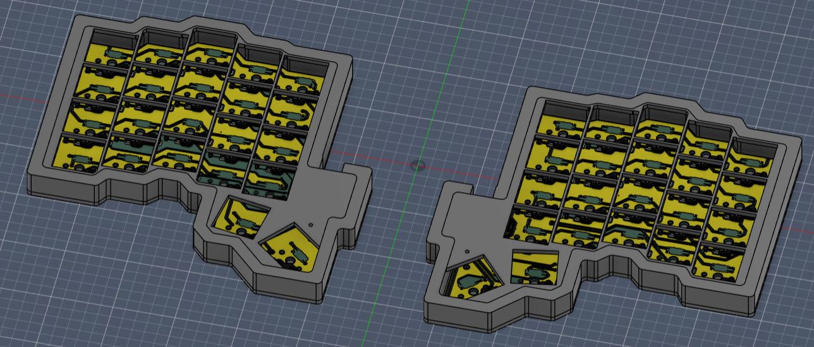
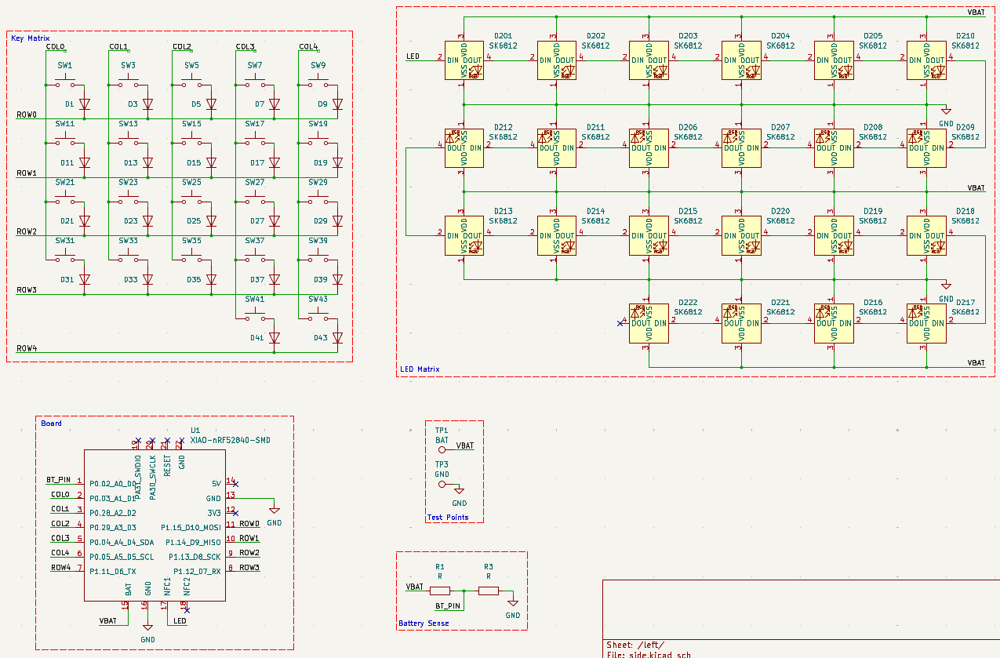
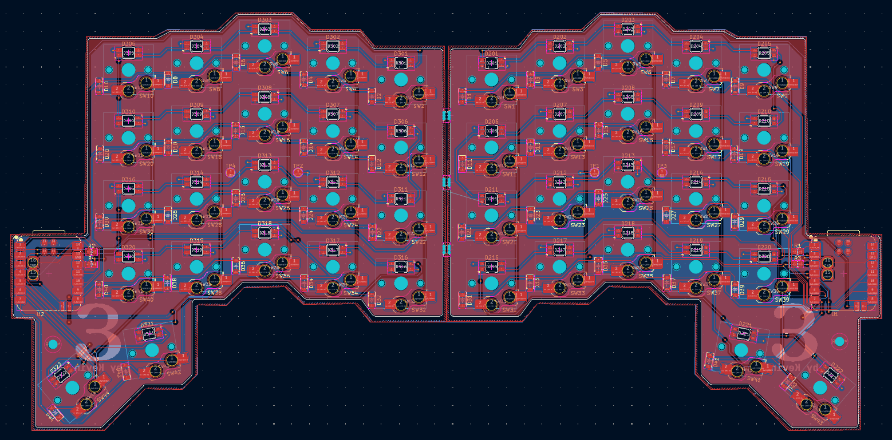
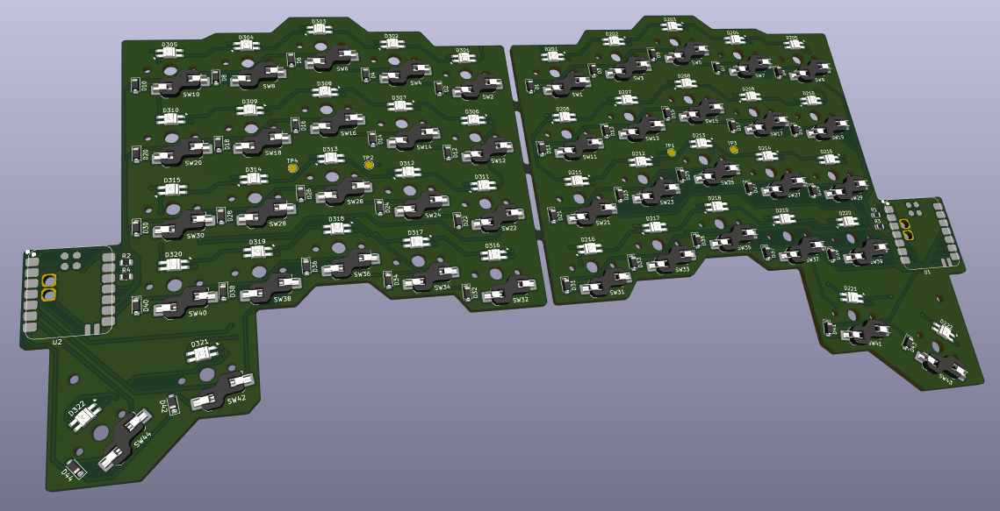
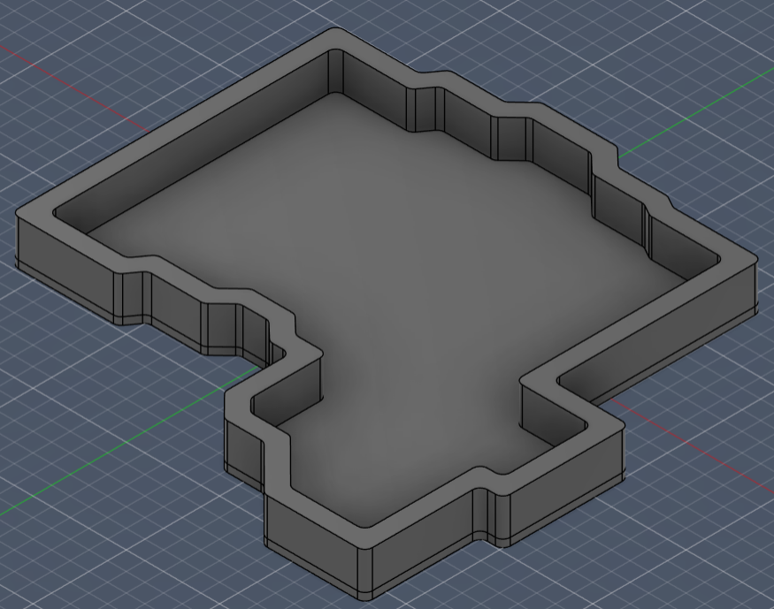
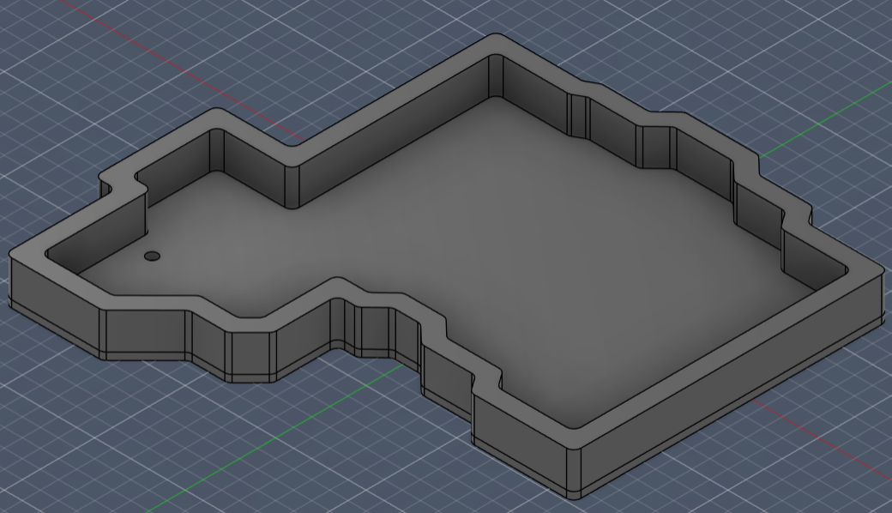

# Epsilon
Columnar split keyboard with 5 columns, 4 rows, and thumb clusters. Made for [Hackclub's Blueprint](https://blueprint.hackclub.com/)

## Details
PCB made using KiCAD \
Case made using Fusion360 \
Firmware made using ZMK

## About
I've always wanted to use a split keyboard, and after making a macropad, I decided the next step was to make a bigger keyboard that could actually replace my regular one for at least some daily use.

## Images

### CAD

### Schematic

### PCB

### Case
| Left Side | Right Side |
|-|-|
|  |  |

## BOM

| Item                                  | Description                                  | Quantity         | Source                                                                                                                                                          | Cost        | Amount                   |
| ------------------------------------- | -------------------------------------------- | ---------------- | --------------------------------------------------------------------------------------------------------------------------------------------------------------- | ----------- | ------------------------ |
| JLC PCB                               | Left and right sides in one piece            | 1                | JLCPCB                                                                                                                                                          | $15.30      | $15.30                   |
| JLC shipping                          | UPS Worldwide Express Saver                  | -                | -                                                                                                                                                               | -           | $15.67                   |
| Case (shipping only)                  | Left and right sides separately              | 2                | Printing Legion                                                                                                                                                 | -           | ~$5                      |
| Kalih Hotswap Sockets                 | Hotswap sockets for Choc V1 switches (x10)   | 5 (44 + 6 extra) | [Chosfox](https://chosfox.com/products/kailh-choc-switch-1350-hot-swap-sockets)                                                                                 | $1.45       | $7.25                    |
| Kailh Choc Low Profile Switches       | Kalih Choc Brown Switches (Tactile) (x10)    | 5 (44 + 6 extra) | [Chosfox](https://chosfox.com/products/kailh-chocs?variant=42514647646402)                                                                                      | $4.5        | $22.50                   |
| Chosfox shipping                      | Standard Shipping China Post                 | -                | -                                                                                                                                                               | -           | $5.20                    |
| CFX Choc Keycaps                      | Chocfox CFX Choc Blank Keycaps (Black) (x10) | 5 (44 + 6 extra) | [NeoMacro](https://typeractive.xyz/products/mbk-keycaps?variant=48512019562727)                                                                                 | ₹350        | ₹1750 (free shipping)    |
| SK6812 MINI-E RGB                     | RGB LEDs (x50)                               | 1 (44 + 6 extra) | [Desertcart](https://www.desertcart.in/products/713547616-50pcs-sk6812-mini-e-rgb-similar-with-ws2812b-sk6812-3228)                                             | ₹1219       | ₹1219 (free shipping)    |
| Seeed Studio XIAO nRF52840            | Microcontroller                              | 2                | [ThinkRobotics](https://thinkrobotics.com/products/seeed-studio-xiao-nrf52840)                                                                                  | ₹1419.93    | ₹2839.86 (free shipping) |
| 1N4148 Diodes                         | 1N4148W SOD-123 Diodes                       | 44               | [Robu](https://robu.in/product/1n4148w-sod-123-1206-diodereel-of-3000/)                                                                                         | ₹0.57 (10+) | ₹25.08                   |
| AC0805FR-072ML-YAGEO                  | 2MΩ Resistor                                 | 2                | [Robu](https://robu.in/product/ac0805fr-072ml-yageo-res-thick-film-0805-2m-ohm-1-0-125w1-8w-%C2%B1100ppm-c-pad-smd-t-r-automotive-aec-q200/)                    | ₹0.64       | ₹1.28                    |
| RT0805FRE071ML-YAGEO                  | 1MΩ Resistor                                 | 2                | [Robu](https://robu.in/product/rt0805fre071ml-yageo-125mw-thin-film-resistor-%C2%B150ppm-%E2%84%83-%C2%B11-1m%CF%89-0805-chip-resistor-surface-mount-rohs/)     | ₹1.38       | ₹2.76                    |
| Battery Jack                          | Black                                        | 2                | [Robu](https://robu.in/product/s2b-ph-klfsn-jst-1x2p-2p-ph-tin-2-25%E2%84%8385%E2%84%83-2a-1-2mm-brass-bend-insert-push-pullp2mm-wire-to-board-connector-rohs/) | ₹13         | ₹26                      |
| LiPo Battery                          | WLY752530 3.7V 500mAh 1S                     | 2                | [Robu](https://robu.in/product/500mah-pcm-protected-micro-li-po-battery/)                                                                                       | ₹261        | ₹522                     |
| Robu shipping                         | Standard Shipping                            | -                | -                                                                                                                                                               | -           | ₹49                      |
| 40x1 Pin 2.54mm Pitch Male Berg Strip | 40pin header                                 | 1                | [Robocraze](https://robocraze.com/products/40x1-pin-2-54mm-pitch-male-berg-strip)                                                                               | ₹6          | ₹6                       |
| Robocraze shipping                    | Standard                                     | -                | -                                                                                                                                                               | -           | ₹49                      |
| M2 Screws                             | Stainless steel, 8mm                         | 4                | [StacksKB](https://stackskb.com/store/m2-screw-8mm-stainless-steel/)                                                                                            | ₹3.10       | ₹12.40                   |
| M2 Hex Nuts                           | Stainless steel                              | 4                | [StacksKB](https://stackskb.com/store/m2-hex-nut-stainless-steel/)                                                                                              | ₹5          | ₹20                      |
| StacksKB shipping                     | Standard                                     | -                | -                                                                                                                                                               | -           | ₹130                     |
| **TOTAL**                             |                                              |                  |                                                                                                                                                                 |             | **~$141**                |
